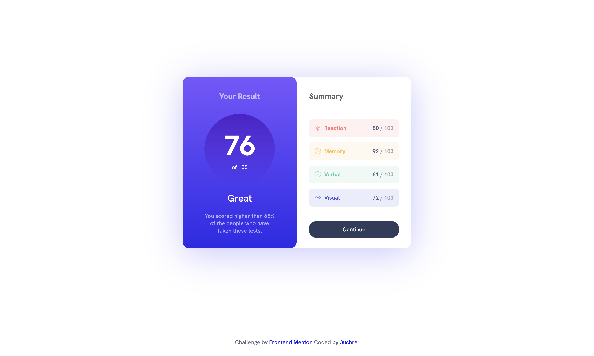

# Frontend Mentor - Results summary component solution

This is a solution to the [Results summary component challenge on Frontend Mentor](https://www.frontendmentor.io/challenges/results-summary-component-CE_K6s0maV). Frontend Mentor challenges help you improve your coding skills by building realistic projects. 

## Table of contents

- [Overview](#overview)
  - [The challenge](#the-challenge)
  - [Screenshot](#screenshot)
  - [Links](#links)
- [My process](#my-process)
  - [Built with](#built-with)
  - [What I learned](#what-i-learned)
- [Author](#author)

## Overview

### The challenge

Users should be able to:

- View the optimal layout for the interface depending on their device's screen size
- See hover and focus states for all interactive elements on the page
- **Bonus**: Use the local JSON data to dynamically populate the content

### Screenshot

### Links

- [Solution URL](https://www.frontendmentor.io/solutions/responsive-score-results-component-with-avg-calc-and-json-editable-data-3TUcv4nZfi)
- [Live Site URL](https://3uchre.github.io/results-summary-component/)

## My process

### Built with

- Semantic HTML5 markup
- CSS custom properties
- Flexbox
- JavaScript
- JSON

### What I learned

- Using JS to read and write JSON data into HTML
- Best practices for inserting HTML through JS, and why `innerHTML` poses security issues

## Author

- Frontend Mentor - [@3uchre](https://www.frontendmentor.io/profile/3uchre)
- GitHub - [@3uchre](https://www.github.com/3uchre)